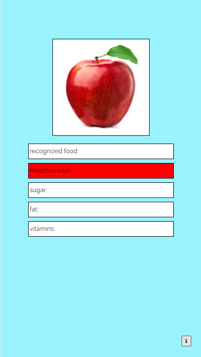

## -Requirements and Analyses: Project Proposal-
## Food Scanner

| Project Leader    | Stefan Landvoigt |
|-------------------|------------------|
| Created on        | 1/10/2021        |
| Last changed      | 5/11/2021 12:18  |
| Processing status | in process       |

|    | Change |         |                  |                        |        |       |
|----|--------|---------|------------------|------------------------|--------|-------|
| No | Date   | Version | Changed Chapters | Description of changes | Author | State |
|    |        |         |                  |                        |        |       |

**Content**

1 Introduction

2 Initial Situation

3 General Conditions and Constraints

4 Project Objectives and System Concepts

5 Opportunities and Risks

6 Planning

# 1. Introduction

#### In Österreich gibt es etwa 600.000 übergewichtige Personen. Dagegen wird bisher zuwenig unternommen, deswegen soll der Food-Scanner diese Marktlücke füllen, denn viele Menschen sind sich ihrer schlechten Ernährung nicht bewusst. Mithilfe diesem Produkt kann man sich die Nährwerte von Lebesmitten ansehen, wie z.B Kalorien, Eiweise, etc. und feststellen, ob ein Lebesmittel gesund bzw. gesundheitsfördernd ist. 
#### Mit unseren Projekt "Food Scanner" kann man mit einer Kamera, die an einen Raspberry Pi angeschlossen ist, Nahrungsmittel scannen und überprüfen, ob diese Gesundheitsfördernd sind oder nicht. Eine KI scannt dann die Produkte und findet heraus um welches Produkt es sich handelt. Danach werden die Nährwerte dieses Produktes ausgegeben. Die Daten der Nährwerte speichern wir in einer Datenbank. Immer mehr Leute sind sich indessen nicht bewusst, welche Lebensmittel ungesund sind und deswegen wollen wir dieser Krise, mit diesem Produkt, den Kampf ansagen. Durch unser Produkt wollen wir die Gesundheit der Menschen fördern, außerdem soll einem das Abnehmen so leichter fallen.

# 2. Initial Situation

#### Wie schon bereits erwähnt, gibt es in Österreich 600.000 übergewichtige Personen, davon sind 24 % der 7-14 Jährigen übergewichtig oder krankhaft übergewichtig. Aktuell informiert sich kaum jemand über die Nährwerte von gekauften Lebensmittel, da es teilweise sehr zeitaufwendig ist, jeden Barcode seines Einkaufes einzeln zu scannen. Außerdem kaufen immer mehr Menschen Lebensmittel vom Markt, die keinen Barcode aufweisen. Das wird sich mit unserem Produkt ändern, weil man die Lebensmittel praktisch und ohne Barcode einscannen kann. Zurzeit gibt es keine bekannte App, die Lebensmittel scannen kann, da alle Food-Scanner-Apps einen Barcodescanner benutzen, wie z.B die App "CodeCheck Product Scanner". 

# 3. General Conditions and Constraints
 
#### Da wir noch keine Erfahrung in der Programmierung von Smartphone-Apps haben, wollen zuerst einen Prototyp auf einem Rasberry-Pi entwickeln. Dafür brauchen wir einen Raspberry Pi, eine Kameras sowie einen kleinen Bildschirm, die mit dem Raspberry Pi verbunden wird. Wir werden vorraussichtlich Java, SQL, HTML, CSS, Typescript verwenden. Das Projekt braucht eine Datenbank mit verschiedenen Produkten, mit deren Nährwerten. Die Datenbank soll lokal auf den Rasberry-Pi gespeichert werden und sobald eine Internetverbindung besteht, werden die Datenbank aktualisiert. 

# 4. Project Objectives and System Concepts

#### Unsere Projektziele:
#### Wir können mit unserem Produkt Lebensmittel ohne Barcode einscannen, also kann man alle Produkte eines Einkaufs gleichzeitig einscannen. Das ist auch bei Produkte ohne oder beschädigtem Barcode der Fall. Die Daten und Nährwerte werden nach dem Scannen des Produkts unterteilt in einer Ausgabe ausgegeben(Zucker, Fett, Vitamine, ...). Die Ausgabe erfolgt über eine Webseite, die in etwa so aussehen wird:

# 5. Opportunities and Risks

#### Möglichkeiten:
#### Wir könnten in den darauffolgenden Jahren eine Foodscanner-Smartphone-App entwickeln, welches auf dem Prototyp mit dem Raspberry-Pi basiert, damit das Produkt verkaufsfähiger wird. 

#### Risks:

#### Da wir nicht jedes Lebensmittel einzeln testen können, würden wir viele Personen brauchen, die das Produkt testen. Weil dafür viel Hardware nötig ist, müssten wir einen Sponsor finden, der unser Projekt unterstützt.

# 6. Planning
### <u>List of major project milestones</u>.

#### 
| Milestones                             | Date        |
|----------------------------------------|-------------|
| Beschaffung der Hardware               | bis 31.1.22 |
| Zusammenbau der Hardware               | bis 28.2.22 |
| Datenbank mit Nährwerten               | bis 20.3.22 |
| Programmierung der Software            | bis 24.7.22 |
| Programmierung und Design der Webseite | bis 24.7.22 |

### <u>Assign project lead and other outstanding roles to team members</u>.
#### Leader: Stefan Landvoigt, Member: Fritz Schernhammer, Florian Röbl

### <u>Give a rough estimate how many resources you need (human resources, licenses, servers, etc.)</u>
####  1 Raspberry Pi,  1 Kamera, 1 kleinen Bildschirm
#### eventuell für jede Person

### <u>Answer the following questions when preparing this section:</u>

### When will the project end? 
#### Ende Juli

### When will the project start?
#### Mitte Jänner

### When will be a first prototype available?
#### Anfang Juni

### When does implementation work start?
#### Wenn wir die Hardware haben(ca. Februar)

### What are the big blocks of work to be done?
#### Implementation, Hardwarezusammenbau, Ausgabe

### Is this work doable in the given period of time?
#### Wenn alles nach Plan läuft, ja.

